# 🚀 MERN App Monitoring Project - Module 6 🌟

Welcome to the **MERN App Monitoring Project**, a cutting-edge demonstration of a full-stack MERN (MongoDB, Express.js, React.js, Node.js) application deployed on a **Kubernetes cluster** with a state-of-the-art monitoring and alerting system. This project showcases a production-ready setup with **CI/CD pipelines**, **Prometheus-based observability**, and **real-time alerting**, ensuring high availability and actionable insights. 🎉

---

## 📖 Table of Contents
- [Project Overview](#project-overview)
- [Architecture](#architecture)
- [Modules](#modules)
  - [Module 1: Monitoring Stack Setup](#module-1-monitoring-stack-setup)
  - [Module 2: Kubernetes Cluster Monitoring](#module-2-kubernetes-cluster-monitoring)
  - [Module 3: Application Metrics](#module-3-application-metrics)
  - [Module 4: Blackbox Probes](#module-4-blackbox-probes)
  - [Module 5: Alerting with Alertmanager](#module-5-alerting-with-alertmanager)
  - [Module 6: Grafana Dashboards](#module-6-grafana-dashboards)
  - [Module 7: Email Notifications](#module-7-email-notifications)
- [Setup Instructions](#setup-instructions)
- [Usage](#usage)
- [References](#references)
- [Contributing](#contributing)
- [License](#license)

---

## 🌍 Project Overview

This project is a **production-grade MERN application** deployed on a Kubernetes cluster hosted on **AWS**. It integrates a robust monitoring stack using **Prometheus**, **Grafana**, **Alertmanager**, and **Blackbox Exporter**, alongside a **CI/CD pipeline** powered by **Jenkins** and **ArgoCD**. The system provides real-time insights into cluster health, application performance, and endpoint availability, with automated email alerts for critical issues.

Key Features:
- 🛠️ **Scalable MERN Stack**: Fully functional MongoDB, Express.js, React.js, and Node.js application.
- ☸️ **Kubernetes Orchestration**: Deployed on a Kubernetes cluster for high availability.
- 📊 **Comprehensive Monitoring**: Node, cluster, and application metrics visualized in Grafana.
- 🚨 **Proactive Alerting**: Real-time notifications via Alertmanager with email integration.
- 🔄 **CI/CD Automation**: Continuous integration and deployment using Jenkins and ArgoCD.

---

## 🏗️ Architecture

The architecture is designed for **scalability**, **observability**, and **reliability**:

- **Frontend**: React.js app served on `http://192.168.119.58:30001`.
- **Backend**: Node.js/Express API at `http://192.168.119.58:30002/api`.
- **Database**: MongoDB for persistent storage.
- **Monitoring Node (192.168.119.170)**: Hosts Prometheus, Grafana, Alertmanager, and Blackbox Exporter via Docker Compose.
- **Kubernetes Cluster (192.168.119.58)**: Runs node-exporter, kube-state-metrics, and the MERN app.
- **CI/CD**: Jenkins for builds, ArgoCD for GitOps-based deployments.

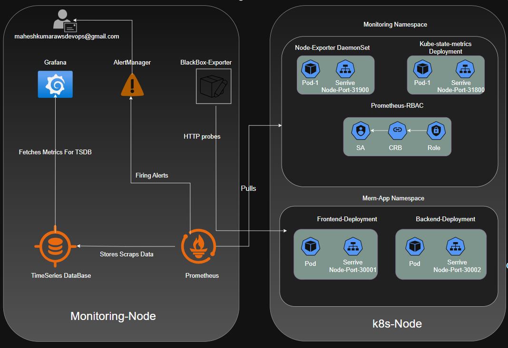

---

## 📚 Modules

### Module 1: Monitoring Stack Setup 🛠️

**Objective**: Set up a monitoring node to host Prometheus, Grafana, Alertmanager, and Blackbox Exporter.

**Tasks**:
- Installed **Docker** and **Docker Compose** on `192.168.119.170`.
- Configured `docker-compose.yml` to deploy the monitoring stack.
- Mounted configuration files: `prometheus.yml`, `alertmanager.yml`, `blackbox.yml`.

**Verification**:
- Running containers verified with `docker ps`.

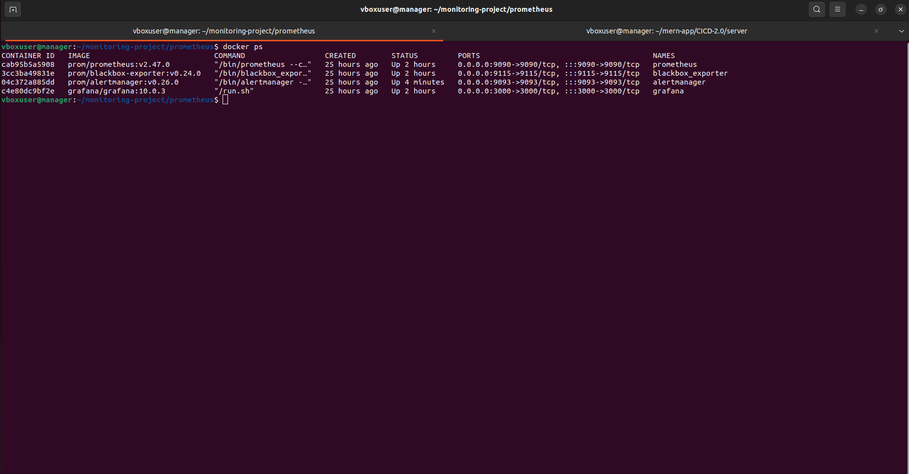

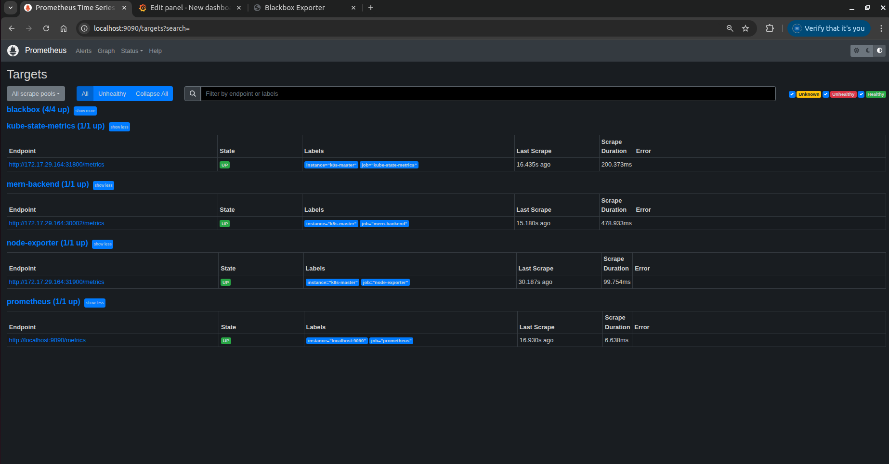

### Module 2: Kubernetes Cluster Monitoring 🌱

**Objective**: Monitor Kubernetes cluster metrics using exporters.

**Tasks**:
- Deployed **node-exporter** for node-level metrics (CPU, memory, disk, network).
- Deployed **kube-state-metrics** for Kubernetes object metrics (pods, deployments, services).
- Configured **RBAC permissions** for Prometheus scraping.
- Updated `prometheus.yml` to scrape metrics from `192.168.119.58`.

**Verification**:
- Confirmed pods and services with `kubectl get all --all-namespaces`.

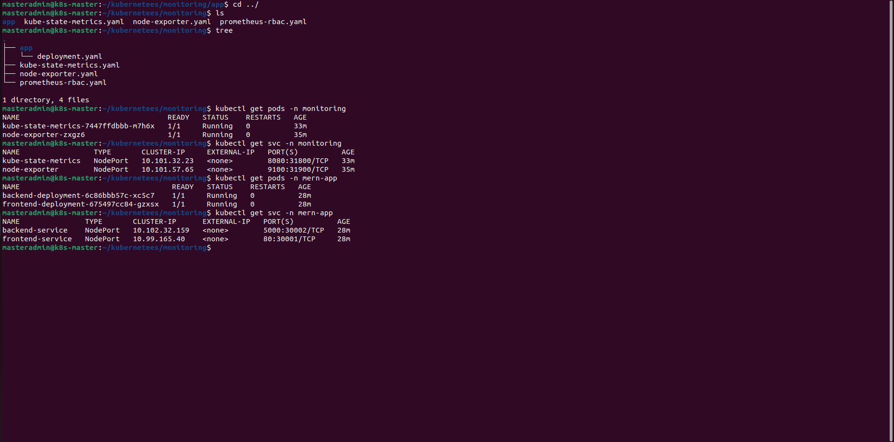

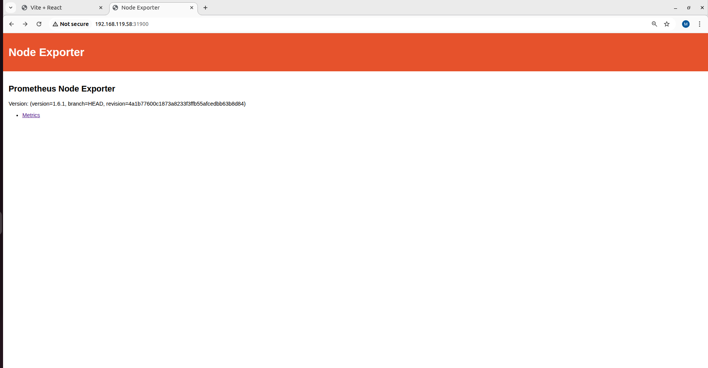

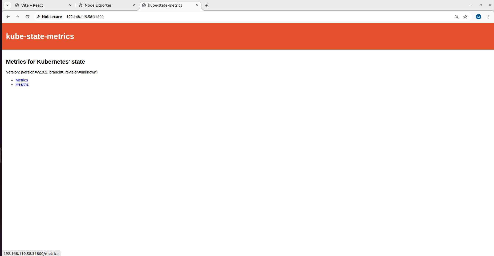


### Module 3: Application Metrics 🎯

**Objective**: Instrument the Node.js backend with custom metrics (request count, latency, error rate).

**Tasks**:
- Integrated **prom-client** in the Node.js backend to expose `/metrics` endpoint.
- Updated Kubernetes Deployment with the new backend code.
- Configured Prometheus to scrape the `/metrics` endpoint.

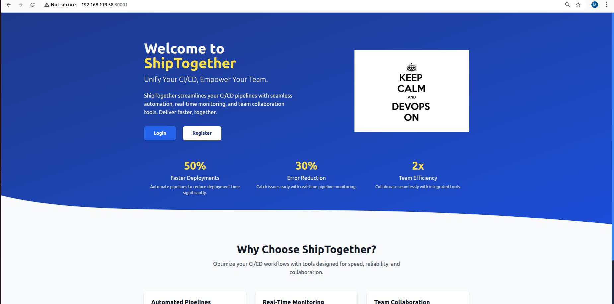


**Steps**:
1. Installed `prom-client`: `npm install prom-client`.
2. Added `/metrics` endpoint in `server.js`.
3. Redeployed backend pod.
4. Updated `prometheus.yml` with new scrape job.

**Verification**:
- Metrics visible in Prometheus UI.


### Module 4: Blackbox Probes 👀

**Objective**: Monitor HTTP uptime and SSL expiration for frontend and backend services.

**Tasks**:
- Configured `blackbox.yml` to probe endpoints (`http://192.168.119.58:30001`, `http://192.168.119.58:30002/api/pipelines/stats`).
- Updated `prometheus.yml` to include Blackbox Exporter scrape jobs.

**Verification**:
- Probe metrics confirmed in Prometheus UI.

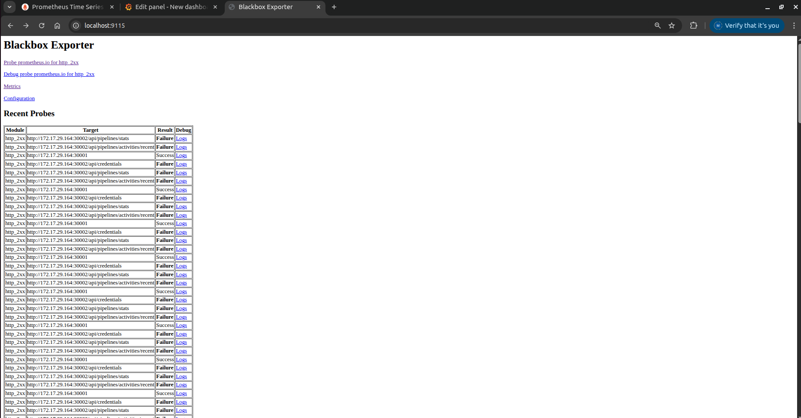

### Module 5: Alerting with Alertmanager ⚠️

**Objective**: Set up alerting rules and email notifications.

**Tasks**:
- Created `alert-rules.yml` for high CPU, pod crashes, and HTTP probe failures.
- Updated `prometheus.yml` to load alert rules.
- Configured `alertmanager.yml` for email notifications to `maheshkumarawsdevops@gmail.com` via Gmail SMTP.
- Tested alerts by stopping a pod.

**Verification**:
- Alerts visible in Prometheus and Alertmanager dashboards.

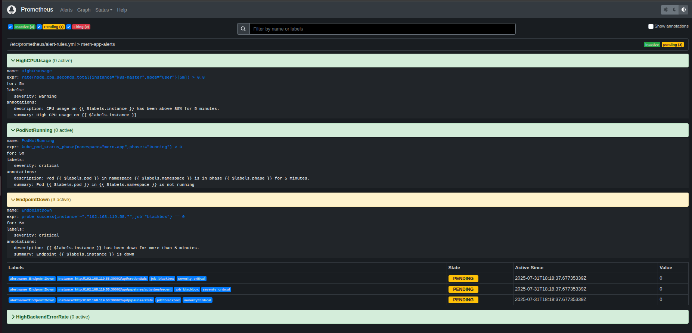  
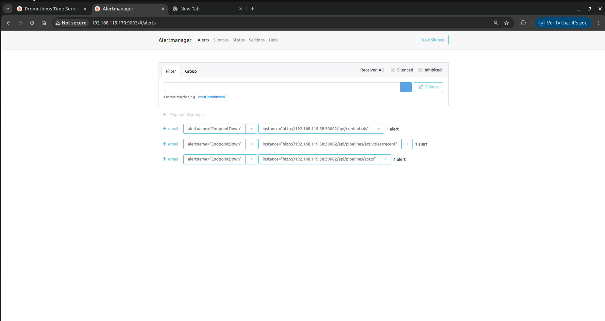

### Module 6: Grafana Dashboards 🎨

**Objective**: Visualize metrics using Grafana dashboards.

**Tasks**:
- Created dashboards for Kubernetes cluster objects and HTTP probes.
- Imported pre-built dashboards and customized for project needs.

**Verification**:
- Dashboards accessible in Grafana.

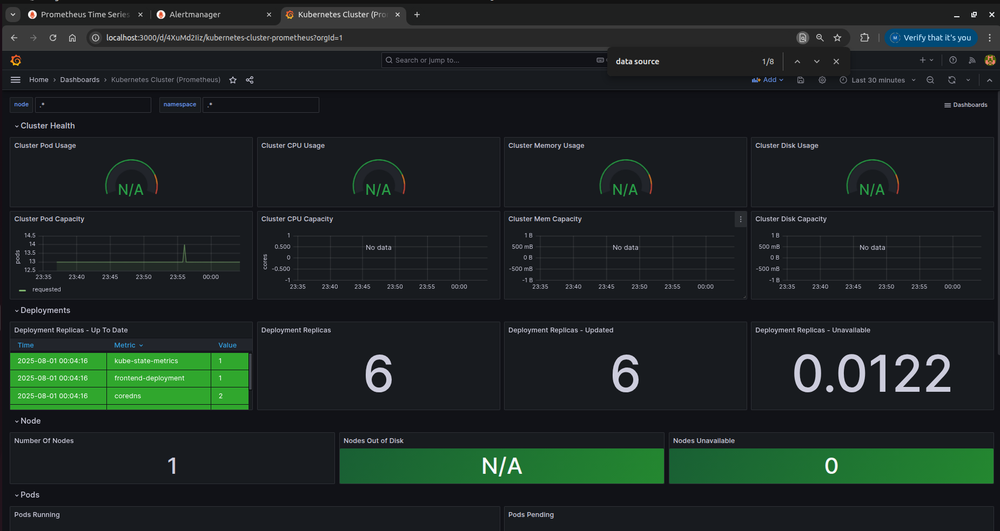  
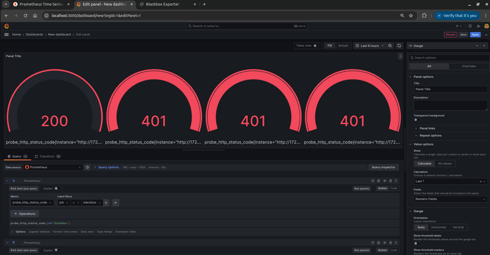

### Module 7: Email Notifications 📬

**Objective**: Demonstrate successful email notifications for alerts.

**Tasks**:
- Configured `alertmanager.yml` with Gmail SMTP credentials (`maheshkumar08042006@gmail.com`).
- Defined `EndpointDown` alert in `alert-rules.yml`.
- Simulated failure by stopping the frontend pod.
- Verified email delivery to `maheshkumarawsdevops@gmail.com`.

**Details**:
- **Sender**: Alertmanager on `192.168.119.170` using `maheshkumar08042006@gmail.com`.
- **Method**: Gmail SMTP (`smtp.gmail.com:587`) with App Password.
- **Purpose**: Notify team of critical issues for rapid resolution.

**Verification**:
- Email received successfully.

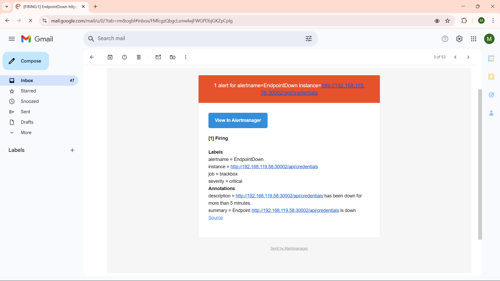

---

## 🛠️ Setup Instructions

1. **Clone the Repositories**:
   ```bash
   git clone ["https://github.com/smahesh-kumarr/monitoring-project.git"]
   git clone ["https://github.com/smahesh-kumarr/kubernetes/tree/main/monitoring"]
   ```

2. **Set Up Monitoring Node (192.168.119.170)**:
   - Install Docker and Docker Compose.
   - Deploy monitoring stack: `docker-compose up -d`.
   - Configure `prometheus.yml`, `alertmanager.yml`, and `blackbox.yml`.

3. **Set Up Kubernetes Cluster (192.168.119.58)**:
   - Deploy node-exporter and kube-state-metrics.
   - Apply RBAC permissions.
   - Deploy MERN app with updated backend code.

4. **Configure Alerting**:
   - Update `alert-rules.yml` and `alertmanager.yml`.
   - Test alerts by simulating failures.

5. **Access Grafana**:
   - Navigate to `http://192.168.119.170:3000` and log in.
   - Import or create dashboards for visualization.

---

## 🚀 Usage

- **Monitoring**: Access Prometheus (`http://192.168.119.170:9090`) and Grafana (`http://192.168.119.170:3000`) for metrics.
- **Alerts**: Monitor Alertmanager (`http://192.168.119.170:9093`) and check emails for notifications.
- **Application**: Access the frontend (`http://192.168.119.58:30001`) and backend API (`http://192.168.119.58:30002/api`).

---

## 🌐 References

- **Monitoring Setup**: [Monitoring Repo URL](#) (https://github.com/smahesh-kumarr/monitoring-project)
- **Kubernetes Deployment**: [k8s Repo URL](#) (https://github.com/smahesh-kumarr/kubernetes/tree/main/monitoring)
- **Prometheus Documentation**: [prometheus.io](https://prometheus.io)
- **Grafana Documentation**: [grafana.com](https://grafana.com)
- **Kubernetes Documentation**: [kubernetes.io](https://kubernetes.io)

---

🎉 **Thank You for Exploring the MERN App Monitoring Project!**  
Built with 💻 and ☕ by [MAHESH KUMAR S]. Reach out at `maheshkumarawsdevops@gmail.com` for questions or feedback! 🚀